# Installation Guide for Ledger Nano S

The **Ledger Vite App** has completed development and has been submitted to Ledger for formal review. Since the review is still in progress, users who want to use Ledger hardware wallet to manage assets on Vite are unable to install the app directly through Ledger Live at the moment. 
This guide explains how to install **Ledger Vite App** on Ledger Nano S from source code.
1. Install VirtualBox;
2. Install Ubuntu on VirtualBox;
3. Download the source code and configure the compilation environment;
4. Compile and install.

Please strictly follow the below steps.

## Install VirtualBox
Download VirtualBox and Extension Pack at [VirtualBox Download Page](https://www.virtualbox.org/wiki/Downloads). Follow the instructions to install VirtualBox first, and then install the Extension Pack.


## Install Ubuntu on VirtualBox
Download the Ubuntu installation file at [Ubuntu Download Page](https://ubuntu.com/#download). Click the button shown in the figure below to start download.


Open VirtualBox and click New to create a new virtual machine.

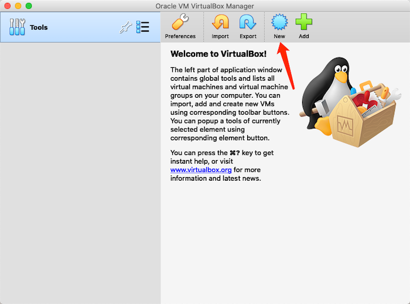

Fill in a name and select a suitable location to store the VM files. In this guide, we use "ubuntu" and the default location.
Note that the Type must be **Linux**, and the Version must be **Ubuntu (64-bit)** to ensure that it is consistent with the installation image we downloaded earlier. Then click Continue.


Set the memory size to 2048 MB or higher, click Continue.


Select "Create a virtual hard disk now", click Create.


Select VDI (VirtualBox Disk Image), click Continue.

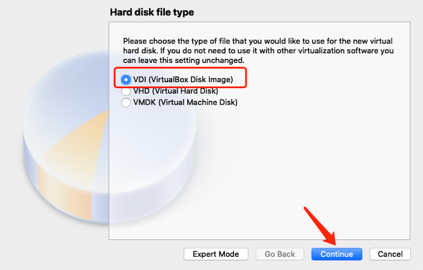

Select "Dynamically allocated", click Continue.

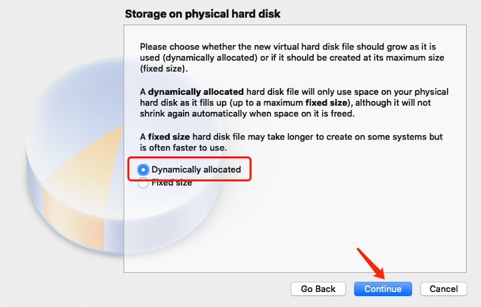

Select the location where the new hard disk will be stored. Here we use the default location and the recommended hard disk size, click Create.

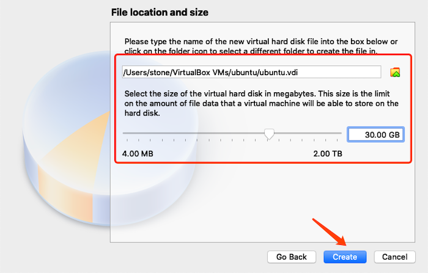

Now the VM is successfully created, load the Ubuntu installation image and click Settings


Click Storage, select Empty under "Controller: IDE", and click the CD icon pointed by the arrow on the right.

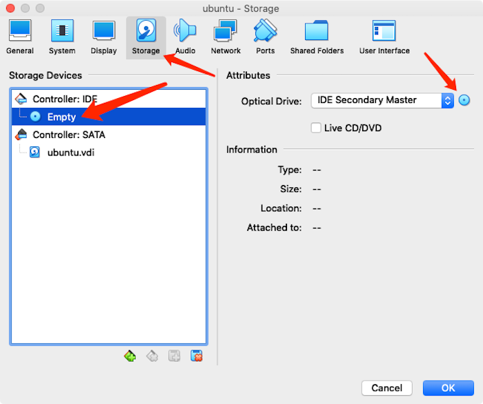

Select Choose/Create a Virtual Optical Disk... 


Click Add to add the image file.

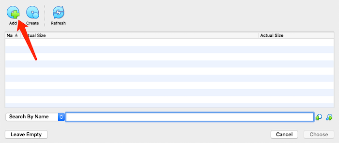

Select the previously downloaded ubuntu-20.04-desktop-amd64.iso image file, click to open.


Select the image file and click Choose.

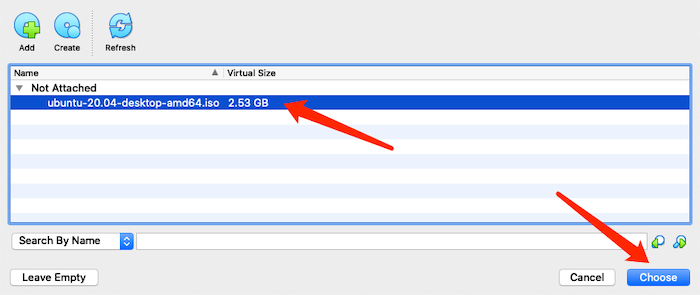

As shown in the figure below, the image file has been added, click OK to save the settings.


Click Start to start the virtual machine.

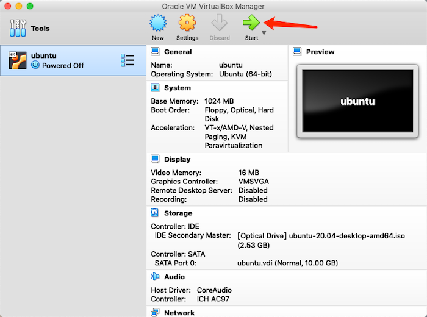

Now finish the Ubuntu installation with the below steps.

Click Install Ubuntu.

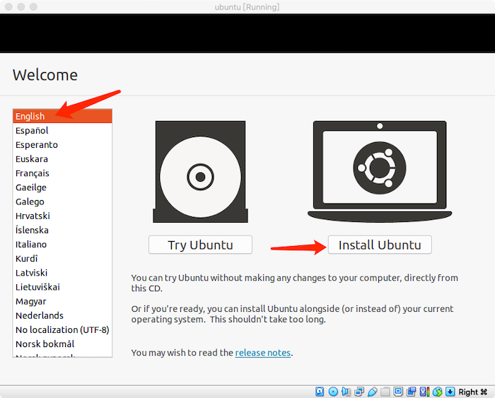

Click Continue.

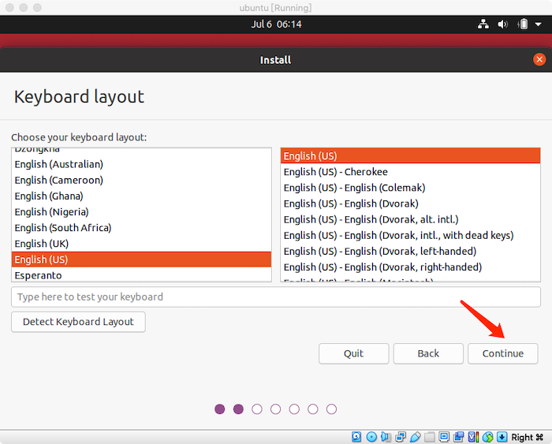

Select Minimal installation, uncheck Download updates while installing Ubuntu, and then click Continue.


Select "Erase disk and install Ubuntu", then click Install Now.

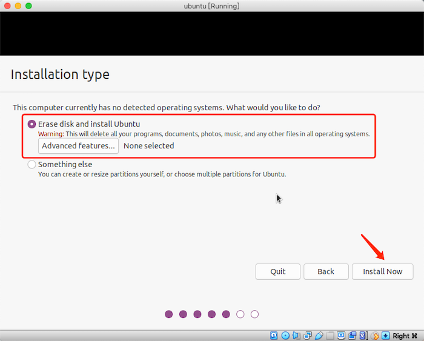

Click Continue.


Select your region, then click Continue.


Enter the username and password, select "Log in automatically", and then click Continue.

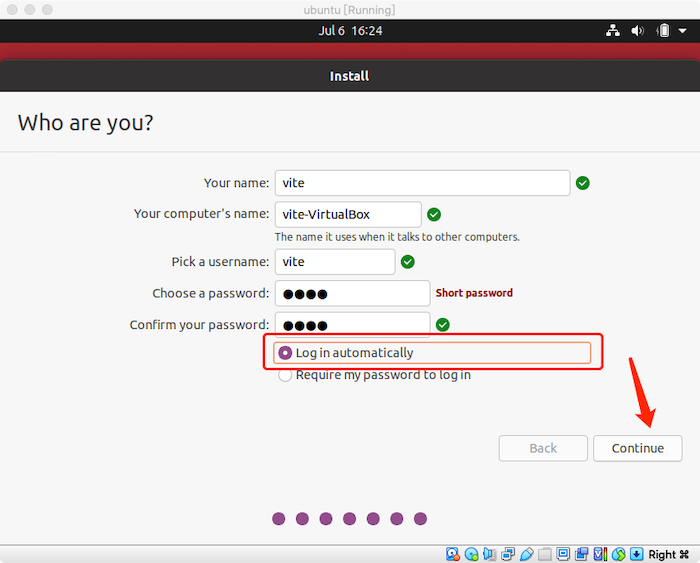

Now the Ubuntu installation will start. Please wait in patience. After the installation is complete, click Restart Now to restart the system.


## Prepare the source code compilation environment
Click Activities, input "terminal" in the search box, and click to open.

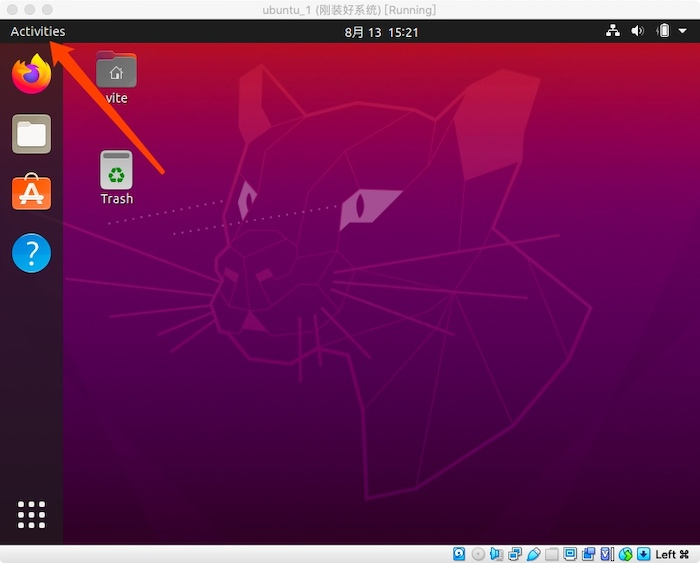

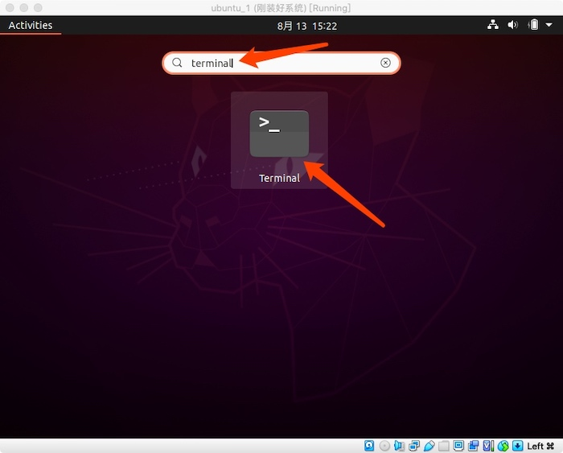

Execute the following command to install the required software packages.
```shell
sudo apt install git build-essential autoconf python3-venv python3-dev libudev-dev libusb-1.0-0-dev gcc-arm-none-eabi gcc-multilib g++-multilib libtinfo5
```
During the installation process, you will be asked to enter the root password. When asked whether to continue, type "Y".

After the installation is successful, execute the following command to download the source code and prepare the compilation environment.
```shell
git clone https://github.com/vitelabs/ledger-app-vite.git
cd ledger-app-vite/
source prepare-devenv.sh
```

## Compile and Install
Insert the Ledger Nano S device into the USB port of the computer.

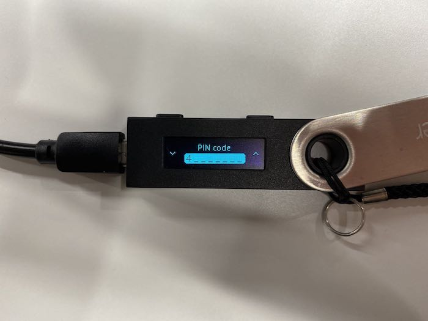

Then enter the PIN code on the device.

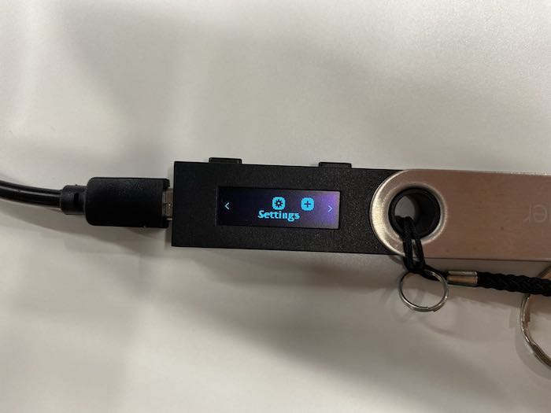

Click the USB icon in the lower right corner of the VM window, select Ledger Nano S to make sure the device is connected to the virtual machine.

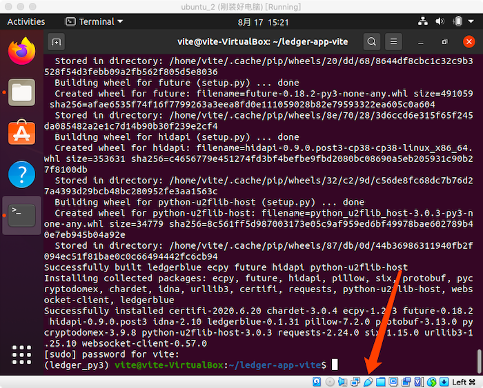


Run the following command to compile and install the Vite App firmware to the Ledger Nano S device.
```shell
make load
```
During the installation process, you will be asked to enter the PIN code, just follow the instructions.

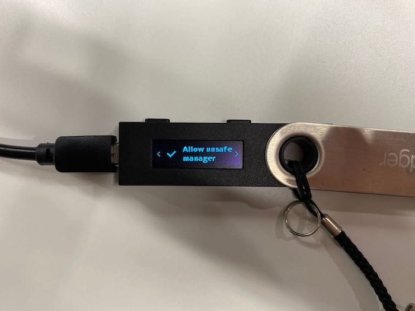

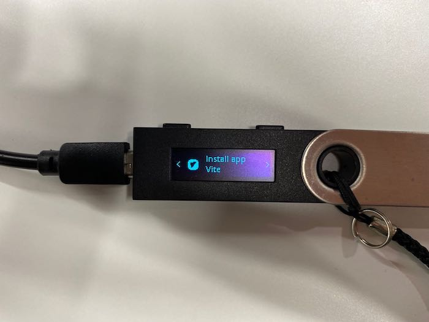

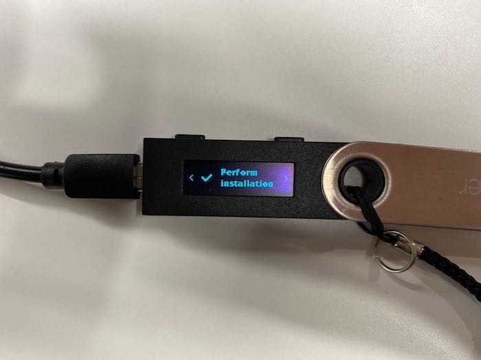

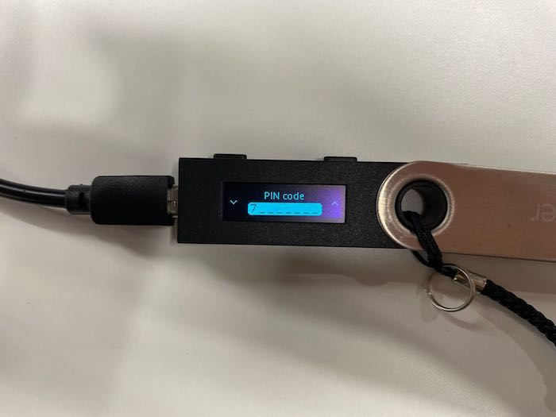

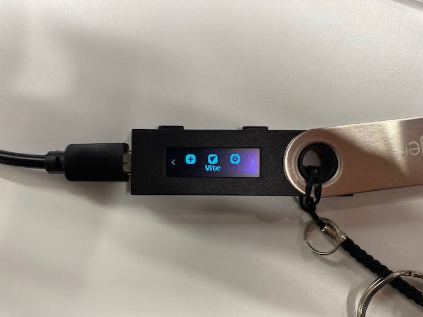

Now Vite should appear on the device's main screen. Congratulations, you have successfully installed the Vite App on the device. 

:::tip Uninstall
Execute the following command and follow the instructions if you need to uninstall Vite App from the device.
```shell
make delete
```
:::
